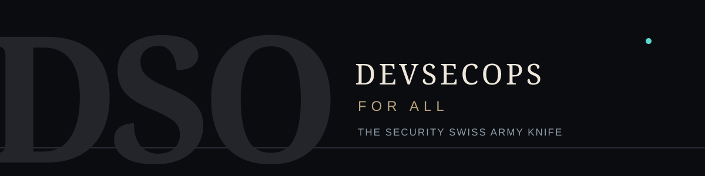

<div align="center">
  

  # DevSecOps for All

  ### The DevSecOps Swiss Army knife

</div>

DevSecOps for All collects security checks, policies, standards, and guidance in one place, so a team can scan its code, enforce controls in its pipelines and clusters, and know what to do with each finding.

**[Quick start](#quick-start)** · **[Find by task](#find-by-task)** · **[What's inside](#whats-inside)** · **[How the repository is organized](#how-the-repository-is-organized)** · **[Roadmap](ROADMAP.md)** · **[Contributing](#contributing)**

## Quick start

Install [Semgrep](https://semgrep.dev/docs/getting-started/quickstart/), clone this repository, and run from its root against a project you are authorized to assess.

```bash
# Mobile app: Android, iOS, React Native, Flutter
semgrep scan --metrics=off --config semgrep-rules/mobile_custom/rules/ path/to/mobile-app

# Python project
semgrep scan --metrics=off --config rules/ path/to/python-project

# Backend code with the imported Trail of Bits rules
semgrep scan --metrics=off --config semgrep-rules/trailofbits/ path/to/project
```

Add `--sarif -o results.sarif` to get a file for GitHub code scanning or DefectDojo. Treat every finding as a lead to verify, not as proof of a vulnerability.

## Find by task

| I want to… | Start here |
| :--- | :--- |
| Scan source code for vulnerabilities | [Semgrep rule packs](semgrep-rules/README.md) · [Python rules](rules/README.md) |
| Review a mobile app | [Mobile rules](semgrep-rules/mobile_custom/README.md) · [OWASP MASTG](guides/owasp-mastg/SOURCE.md) · [MobSF notes](scanners/mobsf/README.md) |
| Find leaked secrets | [gitleaks](scanners/gitleaks/README.md) · [Secret pattern database](scanners/secrets-patterns-db/SOURCE.md) |
| Check dependencies and SBOMs | [osv-scanner](scanners/osv-scanner/README.md) · [Trivy](scanners/trivy/README.md) · [Supply chain policies](policies/supply-chain/README.md) |
| Secure CI/CD pipelines | [CI/CD policies](policies/cicd/README.md) · [CI integrations](integrations/README.md) |
| Check Terraform and other IaC | [Terraform policies](policies/terraform/README.md) |
| Harden containers and Kubernetes | [Container policies](policies/containers/README.md) · [Kyverno and Gatekeeper libraries](policies/kubernetes/README.md) |
| Audit a cloud account | [Cloud policies](policies/cloud/README.md) · [Prowler frameworks](reporting/compliance-mapping/prowler/SOURCE.md) |
| Test a running web app or API | [ZAP](scanners/zap/README.md) · [nuclei](scanners/nuclei/README.md) |
| Map work to a standard (MASVS, ASVS, PCI DSS, CIS) | [Compliance mapping](reporting/compliance-mapping/README.md) |
| Model threats for a feature | [Threat model templates and examples](templates/threat-models/README.md) |
| Fix or triage a finding | [OWASP Cheat Sheets](guides/owasp-cheatsheets/SOURCE.md) · [Playbooks](playbooks/README.md) · [Severity scale](reporting/severity-and-metadata.md) |
| Respond to an incident | [Playbooks](playbooks/README.md) · [Incident response skill](skills/detection-response/incident-response/SKILL.md) |
| Give an AI agent security skills | [Skill catalog](skills/README.md) · [Trail of Bits plugins](skills/trailofbits/README.md) |
| Learn how to run a tool | [Manuals](manuals/README.md) |

## What's inside

**Status:** ✅ ready — our own content, documented and tested · 📦 imported — upstream content with its license and source recorded · 🗺️ planned — structure and plan only.

### Scan

| Directory | Contents | Status |
| :--- | :--- | :--- |
| [`rules/`](rules/README.md) | 3 Python Semgrep rules with tests | ✅ |
| [`semgrep-rules/mobile_custom/`](semgrep-rules/mobile_custom/README.md) | 320 rules for Android, iOS, React Native / Expo, and Flutter / Dart | ✅ |
| [`semgrep-rules/trailofbits/`](semgrep-rules/trailofbits/SOURCE.md) | 120 rules for Go, Python, JavaScript, JVM, Rust, Ruby, HCL, and more | 📦 |
| [`semgrep-rules/elttam/`](semgrep-rules/elttam/SOURCE.md) | 107 rules for Java, Go, PHP, YAML, and generic code; some Java rules need fixes ([details](semgrep-rules/README.md)) | 📦 |
| [`semgrep-rules/profiles/`](semgrep-rules/profiles/README.md) | Rule selections for CI gates, merge request comments, and audits | 🗺️ |
| [`scanners/`](scanners/README.md) | gitleaks default config, secret pattern database, apkleaks patterns, 200+ ZAP scripts, nuclei fuzzing templates; our own scanner configs | 📦 · 🗺️ |

### Enforce

| Directory | Contents | Status |
| :--- | :--- | :--- |
| [`policies/kubernetes/`](policies/kubernetes/README.md) | Kyverno community library with tests; 49 Gatekeeper constraint templates | 📦 |
| [`policies/cicd/`](policies/cicd/README.md) | 26 poutine Rego rules for GitHub Actions, GitLab CI, Azure Pipelines, Tekton | 📦 |
| [`policies/terraform/`](policies/terraform/README.md) | conftest example policies for Terraform, Kubernetes, Dockerfiles | 📦 |
| [`policies/containers/`](policies/containers/README.md) | Reference distroless Dockerfiles | 📦 |
| [`policies/supply-chain/`](policies/supply-chain/README.md) | Sigstore policy-controller examples for signature checks | 📦 |
| [`policies/cloud/`](policies/cloud/README.md) | AWS, GCP, and Azure checks | 🗺️ |
| [`integrations/`](integrations/README.md) | GitHub Actions workflow, GitLab CI template, pre-commit hooks, DefectDojo import | 🗺️ |
| [`tools/`](tools/README.md) | Standalone utilities, starting with the [`dso`](tools/dso/README.md) command-line entry point | 🗺️ |

### Know

| Directory | Contents | Status |
| :--- | :--- | :--- |
| [`guides/`](guides/README.md) | Security review and pentest planning checklists | ✅ |
| [`guides/owasp-cheatsheets/`](guides/owasp-cheatsheets/SOURCE.md) | All 127 OWASP Cheat Sheets | 📦 |
| [`guides/owasp-mastg/`](guides/owasp-mastg/SOURCE.md) | OWASP MASTG tests, techniques, knowledge, and best practices | 📦 |
| [`reporting/`](reporting/README.md) | Normalized severity scale and rule metadata (draft, awaiting agreement) | 🗺️ |
| [`reporting/compliance-mapping/`](reporting/compliance-mapping/README.md) | MASVS, ASVS 5.0, and 88 Prowler frameworks including PCI DSS 4.0, CIS, ISO 27001 | 📦 |
| [`templates/threat-models/`](templates/threat-models/README.md) | OWASP Threat Model Cookbook, Threagile and threatcl examples | 📦 |
| [`manuals/`](manuals/README.md) | How to install, run, and tune each scanner | 🗺️ |
| [`docs/research/`](docs/research/README.md) | Tool evaluations, including the [map of 96 open-source projects](docs/research/open-source-map.md) | ✅ |

### Act

| Directory | Contents | Status |
| :--- | :--- | :--- |
| [`skills/`](skills/README.md) | 51 AI agent skills in 10 security domains | ✅ |
| [`skills/trailofbits/`](skills/trailofbits/README.md) | 23 Claude Code plugins (38 skills): Semgrep rule creation, SARIF analysis, variant analysis, supply-chain risk | 📦 |
| [`playbooks/`](playbooks/README.md) | Leaked secrets, compromised dependencies, finding triage | 🗺️ |
| [`detections/`](detections/README.md) | Sigma, YARA, Falco, and osquery rules | 🗺️ |
| [`labs/`](labs/README.md) | Reproducible vulnerable-and-fixed exercises | 🗺️ |

## How the repository is organized

- **Every directory has a README** that says what belongs there, what is already in it, and its status.
- **Imported content stays in its own directory** with the upstream license and a `SOURCE.md` naming the project, commit, and any changes. All imports are listed in [THIRD_PARTY_NOTICES.md](THIRD_PARTY_NOTICES.md).
- **Research comes first.** A new scanner, policy pack, or imported rule set starts with a note in [`docs/research/`](docs/research/README.md).
- **One severity scale** across tools is defined in [reporting/severity-and-metadata.md](reporting/severity-and-metadata.md).
- **The order of work** is in the [roadmap](ROADMAP.md).

```text
devsecopsforall/
├── rules/  semgrep-rules/  scanners/        scan
├── policies/  integrations/  tools/         enforce
├── guides/  reporting/  templates/
│   manuals/  docs/research/                 know
├── skills/  playbooks/  detections/  labs/  act
├── ROADMAP.md  CONTRIBUTING.md  SECURITY.md
└── THIRD_PARTY_NOTICES.md  LICENSE
```

## Contributing

A precise rule, a tested policy, a clearer manual, or a fixed link are all welcome. Read [CONTRIBUTING.md](CONTRIBUTING.md) and the README of the directory you are changing, include tests or examples that show the behavior, and record the source and license of anything you import. The [roadmap](ROADMAP.md) lists open work.

## Responsible use

> [!IMPORTANT]
> Use these tools only on systems you own or are authorized to assess. Never commit credentials, customer data, or unredacted scan results.

Report vulnerabilities in this repository privately, following the [security policy](SECURITY.md).

## License

Original material is under the [MIT License](LICENSE). Imported content keeps its own license — including GPL-3.0, AGPL-3.0, and CC-BY-SA-4.0 in the directories that carry them; see [THIRD_PARTY_NOTICES.md](THIRD_PARTY_NOTICES.md), the [mobile rule notices](semgrep-rules/mobile_custom/NOTICE.md), and the [skill notices](skills/THIRD_PARTY_NOTICES.md).

<div align="center">
  Maintained by <a href="https://github.com/1ega">@1ega</a> with contributions from the community.
</div>
