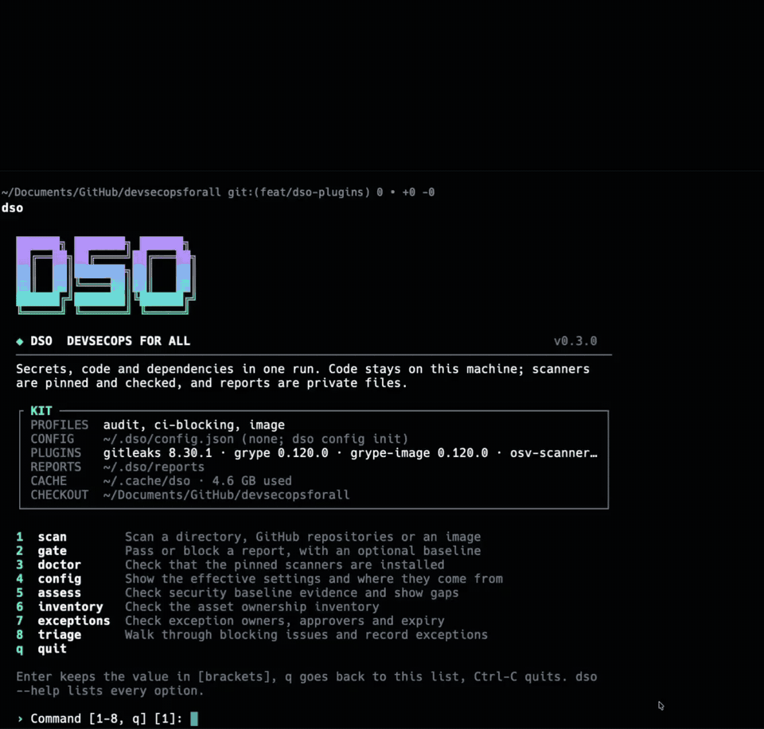
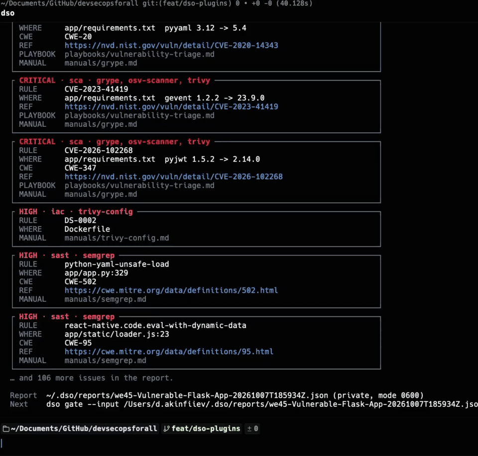

<div align="center">
  

  # DevSecOps for All

  ### The DevSecOps Swiss Army knife

</div>

DevSecOps for All collects security checks, policies, detection rules, standards, and manuals in one place, so a team can scan its code, cloud accounts, and clusters, enforce controls, hunt for malware, and know what to do with each finding.

> 🗺️ **[Explore the interactive DevSecOps roadmap →](https://1ega.github.io/devsecops-for-all-dso/)**
>
> Browse 10 security areas, 29 topics, and 95 tools, with installation steps, usage examples, full manuals, and links to 32 company baseline controls.

**[Quick start](#quick-start)** · **[Find by task](#find-by-task)** · **[What's inside](#whats-inside)** · **[How the repository is organized](#how-the-repository-is-organized)** · **[Roadmap](ROADMAP.md)** · **[Contributing](#contributing)**

## Quick start





DSO scans a local project, public GitHub repository or organization, or container image. It runs pinned scanners, uses a private snapshot for source code, saves a normalized report without secret values, and checks findings against a severity threshold or an approved baseline. Use it from the CLI, [CI](integrations/README.md), or an [MCP client](mcp/dso/README.md).

### Run DSO

Requires Python 3.10+ and Docker. The CLI starts pinned scanner containers; no scanner installation is needed:

```bash
git clone https://github.com/1ega/devsecops-for-all-dso.git
cd devsecops-for-all-dso

python3 tools/dso/dso.py  # interactive menu

report="$(mktemp -d)/report.json"
python3 tools/dso/dso.py scan ../your-project --engine docker \
  --profile ci-blocking --output "$report"
python3 tools/dso/dso.py gate --input "$report" --fail-on high
```

Replace `../your-project` with your project path; `scan` also accepts a GitHub URL or image. The example's `ci-blocking` profile runs Gitleaks, Semgrep and Trivy. The interactive menu can select the fuller `audit` profile when all native scanners are installed. `gate` returns `0` for a pass, `1` for blocking findings and `2` for an incomplete scan. See the [DSO CLI](tools/dso/README.md) for profiles, baselines and exclusions. YARA in `audit` currently requires native mode.

**Local database space:** Trivy's vulnerability database uses about **1.4 GB** on disk even with `ci-blocking`. The full `audit` profile adds Grype and OSV databases, reaching about **4.9 GB**; scanning JAR files may add about **1 GB**. The first full scan downloads about **565 MB** of compressed databases. DSO reuses them from `~/.cache/dso` (or `DSO_CACHE_DIR`) and refreshes them periodically. Select only Gitleaks and Semgrep with `--plugins gitleaks semgrep` to avoid vulnerability databases, which also skips dependency vulnerability checks. Run `python3 tools/dso/dso.py doctor --engine docker --profile audit` to see which databases are present.

**Report limits:** DSO defaults to **20 MiB** for each scanner's output (including Trivy) and the saved report, plus **50,000 findings** per scan. A large repository can make `trivy-config` stop with `report_limit`. Raise both limits for scanning and reading the result:

```bash
python3 tools/dso/dso.py scan ../your-project --engine docker \
  --profile audit --plugins gitleaks trufflehog semgrep trivy grype \
  osv-scanner trivy-config poutine \
  --max-report-mb 256 --max-findings 200000 --output "$report"
python3 tools/dso/dso.py gate --input "$report" \
  --max-report-mb 256 --max-findings 200000
```

Set `DSO_MAX_REPORT_MB=256` and `DSO_MAX_FINDINGS=200000`, or edit those settings in `~/.dso/config.json` (create it with `python3 tools/dso/dso.py config init`) to make this persistent. These limits do not reduce the vulnerability database size.

### Connect an AI agent over MCP

For local scanners, install once and register the stdio server in your MCP client:

```bash
bash mcp/dso/install.sh
```

```json
{
  "mcpServers": {
    "dso": {
      "command": "/absolute/path/to/devsecops-for-all-dso/mcp/dso/.venv/bin/python",
      "args": ["/absolute/path/to/devsecops-for-all-dso/mcp/dso/server.py",
               "--root", "/absolute/path/to/project", "--engine", "native"]
    }
  }
}
```

Set `--root` to the directory the agent may scan; it cannot scan outside that directory. This installation includes the native scanners and uses the same local database cache.

For **MCP in Docker**, build the self-contained image and use this client configuration (replace the absolute path and UID:GID with your own):

```bash
docker build -f mcp/dso/Dockerfile -t dso-mcp:local .
```

```json
{
  "mcpServers": {
    "dso": {
      "command": "docker",
      "args": ["run", "--rm", "-i", "--init", "--read-only",
               "--cap-drop", "ALL", "--security-opt", "no-new-privileges",
               "--user", "YOUR_UID:YOUR_GID",
               "--tmpfs", "/tmp:rw,nosuid,nodev,size=2g,mode=1777",
               "--mount", "type=bind,src=/absolute/path/to/project,dst=/workspace,readonly",
               "--mount", "type=volume,src=dso-cache,dst=/cache",
               "dso-mcp:local"]
    }
  }
}
```

Use `-i` for MCP stdio. The volume keeps the Trivy database between runs. This image includes the `ci-blocking` scanners; the full `audit` and `image` profiles need the [host installation](mcp/dso/README.md#standalone-installation). More Docker options are in the [MCP server guide](mcp/dso/README.md#self-contained-docker-installation).

Review the findings using the [triage playbook](playbooks/vulnerability-triage.md); for exposed credentials, follow the [leaked secret playbook](playbooks/leaked-secret.md). To run a single scanner directly, see its [manual](manuals/README.md). For a company-wide rollout, start with the [SMB guide](guides/smb-security.md) and [security baseline](baseline/README.md).

## Find by task

| Task | Start here |
| :--- | :--- |
| Find secrets | [Gitleaks manual](manuals/gitleaks.md) · [Secret patterns](rules/secrets/secrets-patterns-db/SOURCE.md) |
| Review source code | [Semgrep rule packs](rules/semgrep/README.md) · [Code review checklist](guides/security-review.md) |
| Review a mobile app | [Mobile rules](rules/semgrep/mobile/README.md) · [OWASP MASTG](guides/owasp-mastg/SOURCE.md) |
| Check dependencies and images | [Grype](scanners/grype/README.md) · [Trivy](scanners/trivy/README.md) |
| Add security checks to CI | [GitHub Actions](integrations/github-actions/README.md) · [GitLab CI](integrations/gitlab-ci/README.md) · [pre-commit](integrations/pre-commit/README.md) |
| Check infrastructure code | [Terraform / conftest policies](policies/terraform/README.md) · [Trivy IaC config](scanners/trivy/config.yaml) |
| Harden Kubernetes | [Starter policies](policies/kubernetes/starter/README.md) · [Kyverno and Gatekeeper libraries](policies/kubernetes/README.md) |
| Audit cloud and SaaS accounts | [Prowler](scanners/prowler/README.md) · [SCuBA](manuals/scuba.md) |
| Test web apps and APIs | [ZAP manual](manuals/zap.md) · [API authorization tests](guides/api-authorization.md) |
| Detect malware or runtime threats | [YARA rules](rules/yara/README.md) · [Falco rules](rules/falco/README.md) |
| Handle findings and incidents | [Response playbooks](playbooks/README.md) · [OWASP Cheat Sheets](guides/owasp-cheatsheets/SOURCE.md) |
| Test backup recovery | [Restic manual](manuals/restic.md) · [Restore drill](playbooks/restore-drill.md) |
| Work with security standards | [ASVS, MASVS and Prowler frameworks](reporting/compliance-mapping/README.md) |
| Model threats | [Templates and examples](templates/threat-models/README.md) |
| Use security skills with an AI agent | [Skill catalog](skills/README.md) · [Trail of Bits plugins](skills/trailofbits/README.md) |

## What's inside

- [`rules/`](rules/README.md) — Semgrep, YARA, secret patterns, nuclei templates and Falco rules.
- [`scanners/`](scanners/README.md) — scanner configurations, Grype/Prowler/Trivy wrappers and ZAP scripts.
- [`policies/`](policies/README.md) — Kubernetes, Terraform, CI/CD, container and supply chain policies.
- [`integrations/`](integrations/README.md) — GitHub Actions, GitLab CI and pre-commit templates.
- [`mcp/dso/`](mcp/dso/README.md) — local MCP tools, standalone installer and Docker image for repository scans and finding gates.
- [`baseline/`](baseline/README.md) and [`tools/dso/`](tools/dso/README.md) — company controls, inventory templates and evidence checks.
- [`manuals/`](manuals/README.md) and [`guides/`](guides/README.md) — tool setup, usage, review checklists and OWASP references.
- [`playbooks/`](playbooks/README.md) and [`reporting/`](reporting/README.md) — incident procedures, finding records, severity conventions and compliance references.
- [`templates/`](templates/README.md) — threat model templates and worked examples.
- [`skills/`](skills/README.md) — instructions for AI coding agents, including imported Trail of Bits plugins.
- [`docs/research/`](docs/research/README.md) — tool evaluations and implementation notes.

## How the repository is organized

Imported packs live in separate directories with their upstream license and a `SOURCE.md` recording the source commit and local changes. Collections assembled from several upstreams, the [mobile Semgrep rules](rules/semgrep/mobile/NOTICE.md) and the imported [AI skills](skills/THIRD_PARTY_NOTICES.md), record each source in a notice file instead. The [third-party notices](THIRD_PARTY_NOTICES.md) list the imports.

Check the component's README for its requirements, status and validation scope. Some directories contain reference material or plans: DefectDojo ingestion, cloud evidence collectors, external finding lifecycle adapters and [labs](labs/README.md) are still planned. The [roadmap](ROADMAP.md) tracks that work; the [review record](docs/research/smb-operational-gaps.md) describes what has been checked so far.

## Contributing

For bugs and questions, open an [issue](https://github.com/1ega/devsecops-for-all-dso/issues). To contribute rules, policies, examples or documentation, read [CONTRIBUTING.md](CONTRIBUTING.md). It covers tests, import requirements and where to put changes. The [validation guide](tools/validation/README.md) lists the repository checks.

Maintained by [@1ega](https://github.com/1ega).

## Security

Use the tools on systems you own or have permission to assess. Keep credentials and unredacted findings out of public commits and issues. Report vulnerabilities in this repository privately through [SECURITY.md](SECURITY.md).

## License

Original material is under the [MIT License](LICENSE). Imported content retains its upstream license; check the license in the relevant directory and [THIRD_PARTY_NOTICES.md](THIRD_PARTY_NOTICES.md) before reusing it. Additional notices cover the [mobile rules](rules/semgrep/mobile/NOTICE.md) and [AI skills](skills/THIRD_PARTY_NOTICES.md).
